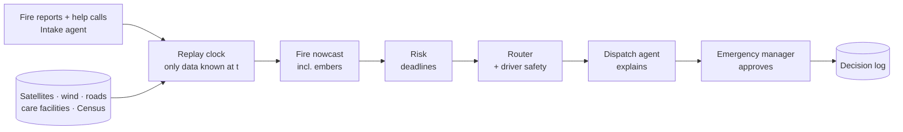

# Outrun

**AI evacuation dispatch for people who can't outrun a wildfire.**

During a wildfire, Outrun turns incoming fire reports and help calls into a live picture of where
the fire is heading, including ember risk ahead of the main front. It finds the people who can't
leave on their own (care-home residents, wheelchair users, people on oxygen, bedbound people,
people without a car) and plans which vehicle should pick up whom, re-planning every 10 minutes.
It never sends a driver into a place fire could reach before they get out. A county emergency
manager approves every dispatch.

We prove it by replaying the **2025 Eaton Fire** night through it, using only what was known at each
moment. The demo plays back precomputed files. It leads with warning lead time, then shows how much
information, warning time, fleet size and routing each change the outcome. Figures are ranges under
stated assumptions; we never claim we would have saved specific people.

> IBM SkillsBuild AI Experiential Learning Lab · Government & Public Services · built with **IBM Bob**
> and **watsonx Orchestrate**

| | |
|---|---|
| Product spec | [`docs/PRD.md`](docs/PRD.md) |
| Architecture | [`docs/ARCHITECTURE.md`](docs/ARCHITECTURE.md) |
| Team and owners | [`docs/TEAM.md`](docs/TEAM.md) |
| Evaluation values (proposal) | [`docs/EVAL_SPEC.md`](docs/EVAL_SPEC.md) |
| How everything works | [`docs/HOW_IT_WORKS.md`](docs/HOW_IT_WORKS.md) |
| How we work | [`docs/TEAM_PLAYBOOK.md`](docs/TEAM_PLAYBOOK.md) |

## Why

On Jan 7, 2025, high winds grounded every aircraft 27 minutes after the Eaton Fire started, and
responders lost their real-time view of it. Fire reports west of Lake Avenue came in from late
evening; the first satellite detection came at 1:30 a.m.; orders for west Altadena came at 3:25 a.m.
All 17 people who died were west of Lake Avenue, and many were elderly or disabled.

Decisions tracked the main fire front while embers burned homes ahead of it. Nobody was continuously
matching the people who needed a ride to the vehicles available and the time left. That's what
Outrun does. (Sources: `DATA_SOURCES.md`.)

## How it works

**Agents explain, engines compute.** LLM agents never produce numbers. Every probability, deadline
and route comes from a tested engine.



## Quickstart

Requires [uv](https://docs.astral.sh/uv/) (it installs the right Python) and `make`.

```bash
git clone https://github.com/alighazi288/Outrun.git && cd Outrun
make install    # Python deps
make check      # lint + all tests (what CI runs)
make api        # API at http://localhost:8000, interactive docs at /docs
make export     # precompute the replay frames into replay/
make help       # everything else
```

Extras per card: `uv sync --group dev --extra routing` (OR-Tools, OSMnx), `--extra wx` (HRRR wind),
`--extra geo`, `--extra eval`.

## Layout

| Path | What goes here |
|---|---|
| `backend/` | Shared data formats (`schemas.py`), every assumed number (`assumptions.py`), replay clock, who-is-known rule, FastAPI + OpenAPI tools |
| `engines/` | Fire nowcast, risk, travel time, router with the driver-safety rule |
| `agents/` | watsonx Orchestrate agent YAML (Intake, Dispatch) |
| `dashboard/` | React map. The judged demo plays saved frames |
| `evaluation/` | Dispatcher heuristic, arrival window, sweeps, report |
| `data/` | Dataset contract, fake test fixtures, `raw/` (not committed), `processed/` (small files), `BUILD.md` |
| `scripts/` | Fake-data generator, OpenAPI export, data-build scripts |
| `tests/` | Contract tests every folder must pass (no hindsight, driver safety, never dropped) |
| `notebooks/` | Exploration |
| `docs/` | PRD, architecture, team, eval spec, how it works, playbook, submission |
| `bob_sessions/` | IBM Bob session screenshots (required for judging) |
| `DATA_SOURCES.md` | Every public site used, with attribution |


**What's real and what isn't:** fire reports, satellites, wind, roads, care facilities, order times
and which buildings burned are real public data. Homebound residents and their calls are simulated
from Census counts, because real addresses and 911 records aren't public.

## Team rules

1. **Agents never produce numbers.** Engines do; agents explain.
2. **No hindsight.** Engines only see data from before time t.
3. **Never drop anyone silently.** At-risk people are routed or escalated.
4. **Never send a driver into danger.** The safety rule is tested on every route.
5. **No hidden guesses.** Every assumed number lives in `backend/assumptions.py`, labeled and tested over a range.
6. **Use Bob and screenshot every session** into `bob_sessions/`.

## Data and attribution

See [`DATA_SOURCES.md`](DATA_SOURCES.md). Map data © OpenStreetMap contributors (ODbL).
